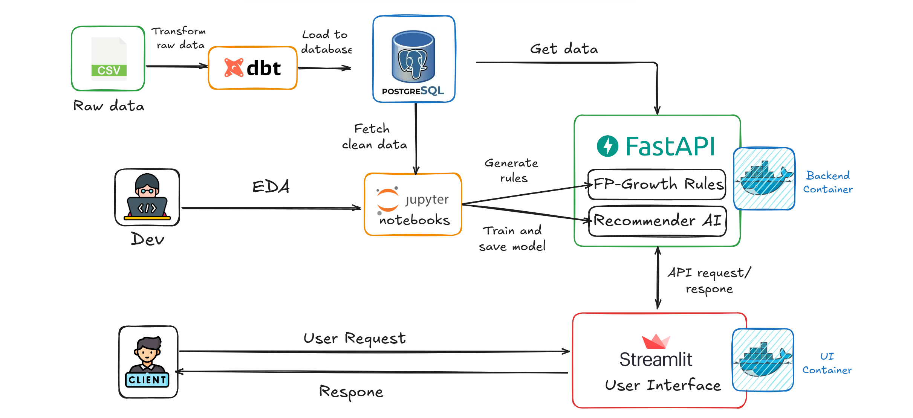

# Market Basket Analysis Demo

# Table of Contents
**1. [Overview](#1-overview)**
   - [Idea](#11-idea)

   - [Reference Links](#12-reference-links)

**2. [System Architecture](#2-system-architecture)**

**3. [Repository Structure](#3-repository-structure)**

**4. [Technologies Used](#4-technologies-used)**

**5. [Installation](#5-installation)**
   - [Prerequisites](#51-prerequisites)

   - [Quick Start with Docker](#52-quick-start-with-docker)
   - [Run without Docker](#53-run-without-docker-optional)

**6. [Run dbt Project](#6-run-dbt-project)**
   - [Configure Database Connection](#61-configure-database-connection)

   - [Initialize dbt](#62-initialize-dbt)
   - [Seed data](#63-seed-data)
   - [Run Models](#64-run-models)
   - [Test Models](#65-test-models-optional)
   - [Export Models to CSV](#66-export-models-to-csv)
   - [Summary Workflow](#67-summary-workflow)

**7. [API Overview](#7-api-overview)**
   - [Endpoints](#endpoints)
   
   - [Example Requests](#example-requests)
   - [Status Codes](#-status-codes)


## 1. Overview
This project aims to build a recommendation system based on **FP-Growth** and **Neural Collaborative Filtering (NCF)** to solve the **Market Basket Analysis** problem.

FP-Growth is part of Association Rule Mining family and is widely used in recommendation systems due to its ability to handle small datasets, provide interpretable rules, and address cold-start problems—issues common in deep learning models.
### 1.1 Idea
Given an item purchased by a customer, the API will return a list of items that are frequently bought together based on FP-Growth association rules. In addition, we integrate a personalized recommendation model (NCF) trained via deep learning to boost accuracy.
### 1.2 Reference Links
- [Use cases of Association Rule Mining - Kaggle](https://www.kaggle.com/code/mohammedderouiche/association-rule-mining-for-mba)
---

## 2. System Architecture


## 3. Repository Structure
```bash
.
├── backend/                # FastAPI backend
│   ├── main.py             # API entry point
│   ├── recommender_fp.py   # FP-Growth logic
│   ├── recommender_dl.py   # NCF recommendation logic
│   ├── logger.py           # Logging configuration
│   └── ...
├── dbt_project/         # dbt project (models, analysis, seeds, tests, ...)
├── ui/                    # Streamlit user interface
├── data/                  # Input datasets (.csv, .db)
├── models/                # Trained models (NCF, FP rules)
├── docker/                # Docker-related files
│   ├── Dockerfile.backend
│   ├── Dockerfile.ui
│   ├── docker-compose.yml
│   ├── entrypoint.sh
│   └── ...
├── notebooks/             # Exploratory notebooks for training
└── requirements.txt       # Python dependencies
```

## 4. Technologies Used
- **Linux**

- **FastAPI** for backend RESTful APIs with logging
- **dbt (Data Build Tool)** for data transformation
- **Docker** and **Docker Compose** for containerization
- **Streamlit** for building the frontend UI
- **Postgres** for local database
- **FP-Growth** algorithm and **NCF** deep learning model


## 5. Installation
### 5.1 Prerequisites
- Docker & Docker-Compose installed
- Python 3.10+ (if running locally without Docker)
### 5.2 Quick Start with Docker
```bash
git clone https://github.com/nhnammldlnlpcvrs/recommendation-systems-rule-base.git

cd recommendation-systems-rule-base/docker

docker compose up --build
```
#### Access:
- Backend API: http://localhost:8000/docs
- Frontend (Streamlit): http://localhost:8501
### 5.3 Run without Docker (Optional)

#### Run Backend API
```bash
pip install -r requirements_dev.txt

uvicorn backend.main:app --reload
```
#### Run Frontend
```bash
cd ui

streamlit run streamlit_app.py
```
## 6. Run dbt Project

After setting up the environment and database connection, you can now execute the dbt pipeline to transform, clean, and prepare analytical tables.

### 6.1 Configure Database Connection 

**Create or edit your dbt profiles.yml file:**

- Linux/macOS: 
```bash
~/.dbt/profiles.yml
```

- Windows: 
```bash
%USERPROFILE%\.dbt\profiles.yml
```
Example:

```yml
dbt_project:
  target: dev
  outputs:
    dev:
      type: postgres
      host: localhost
      user: postgres
      password: your_password
      port: 5432
      dbname: fp_growth_mba
      schema: public
      threads: 4
      keepalives_idle: 0
```

### 6.2 Initialize dbt
```bash
cd dbt_project

dbt deps
```
This command installs all dbt packages defined in the **packages.yml** file, such as:

- dbt_utils

- dbt_labs

A package-lock.yml file will be automatically created to lock dependency versions.

### 6.3 Seed data
```bash
dbt seed
```
This command loads the CSV files located in the **seeds**/ folder into your PostgreSQL database.
These raw datasets act as the foundation for all subsequent transformations.
### 6.4 Run Models
```bash
dbt run
```
This executes all dbt models (SQL transformations) defined in your **models**/ directory.
It will build the cleaned and transformed tables — for example:

- stg_online_retail

- user_item_dl

- transaction_fpgrowth

All models will be materialized in your target schema (e.g., public) of the PostgreSQL database.
### 6.5 Test Models (Optional)
```bash
dbt test
```
Runs all the defined data tests in your project to validate data quality, such as:

- Non-null checks

- Uniqueness constraints

- Referential integrity

### 6.6 Export Models to CSV
```bash
cd utils

python export_data.py
```
This script connects to your fp_growth_mba PostgreSQL database and exports the final dbt model tables (e.g., transaction_fpgrowth, user_item_dl) as CSV files into the **data**/ directory.

### 6.7 Summary Workflow

- Install dependencies -> dbt deps

- Load raw data -> dbt seed

- Run transformations -> dbt run

- (Optional) Test data -> dbt test

- Export results -> python export_data.py

## 7. API Overview
Base URL: http://localhost:8000

Interactive Docs
- Swagger UI: http://localhost:8000/docs

### Endpoints
| Method | Endpoint             | Query Params                              | Description                                                                            |
| ------ | -------------------- | ----------------------------------------- | -------------------------------------------------------------------------------------- |
| GET    | `/recommend/by-item` | `item` (str), `top_k` (int, default=5)    | Recommend items frequently bought together using **FP-Growth**.                        |
| GET    | `/recommend/by-user` | `user_id` (int), `top_k` (int, default=5) | Recommend items based on user behavior using **Neural Collaborative Filtering (NCF)**. |

### Example Requests

Recommend by Item

```cpp
GET /recommend/by-item?item=charlotte+bag+suki+design&top_k=3
```

Response:
```cpp
{
    "item": "charlotte bag suki design",
    "suggestions": [
        {
            "item": "red retrospot charlotte bag",
            "score": 0.5094
        },
        {
            "item": "woodland charlotte bag",
            "score": 0.4137
        },
        {
            "item": "strawberry charlotte bag",
            "score": 0.4
        }
    ]
}
```
Recommend by User
```cpp
GET /recommend/by-user?user_id=17841&top_k=3
```

Response:
```cpp
{
    "user_id": 17841,
    "suggestions": [
        {
            "item": "magic garden felt garland",
            "score": 1.0
        },
        {
            "item": "house shape pencil sharpener",
            "score": 1.0
        },
        {
            "item": "office mug warmer polkadot",
            "score": 1.0
        }
    ]
}
```
### ✅ Status Codes
- 200 OK – Request successful

- 422 Unprocessable Entity – Missing or invalid query parameters

---

## 8. Integrating with the sb-ecom project

Use these steps whenever you want to rebuild the AI recommendation service using data generated by the Spring Boot application (`sb-ecom`):

1. **Transform data with dbt**
   - Enter `E:\Pj1\dbt_project`
   - Configure your `~/.dbt/profiles.yml` using `profiles.yml.example`
   - Run `dbt deps && dbt run` to populate `transaction_fpgrowth` and `user_item_dl`
2. **Export marts to CSV**
   - `cd E:\Pj1\utils`
   - `python export_data.py`
   - The script copies both tables to `recommendation-systems-rule-base/data/`
3. **Regenerate FP-Growth rules**
   - `cd ..\recommendation-systems-rule-base\utils`
   - `python build_rules.py --min-support 0.01 --min-confidence 0.2`
   - Adjust the thresholds if you need more/fewer rules
4. **Retrain the neural model (optional but recommended)**
   - Still inside `utils`, run `python train_ncf.py --epochs 8 --batch-size 2048`
   - This writes an updated `models/ncf_model.pt`
5. **Start the FastAPI service**
   - `cd ..`
   - `uvicorn backend.main:app --reload`
   - The service listens on `http://localhost:8000` by default
6. **Call the service from sb-ecom**
   - Ensure `sb-ecom/src/main/resources/application.properties` has `recommendation.base-url=http://localhost:8000`
   - The backend already exposes `/api/public/recommendations/products/{productId}` and `/api/user/recommendations`

Whenever you refresh any upstream step (dbt run, export, build rules, retrain), restart the FastAPI process so it can reload the latest artifacts.